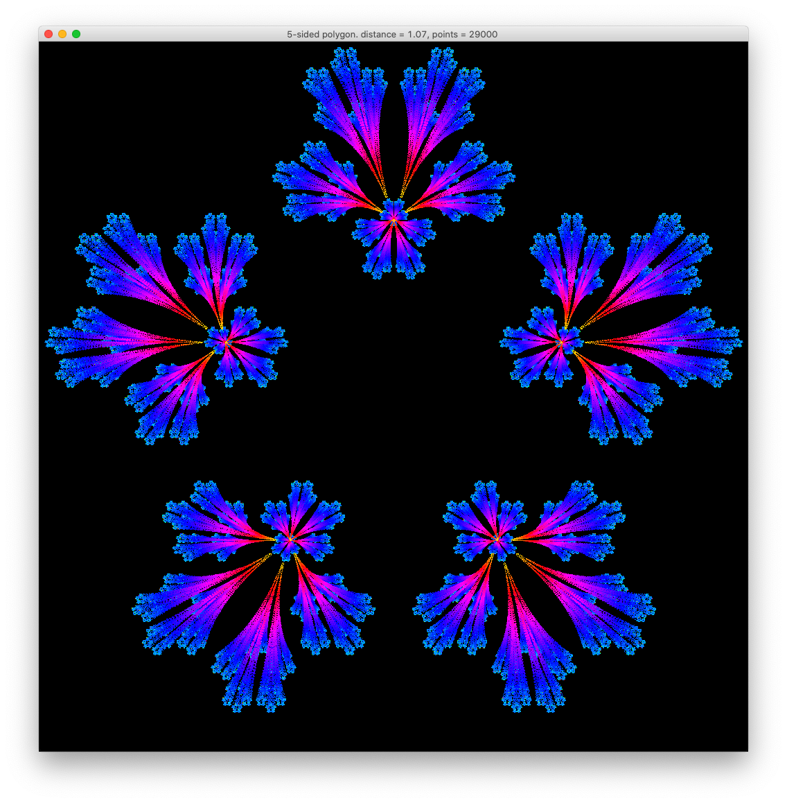
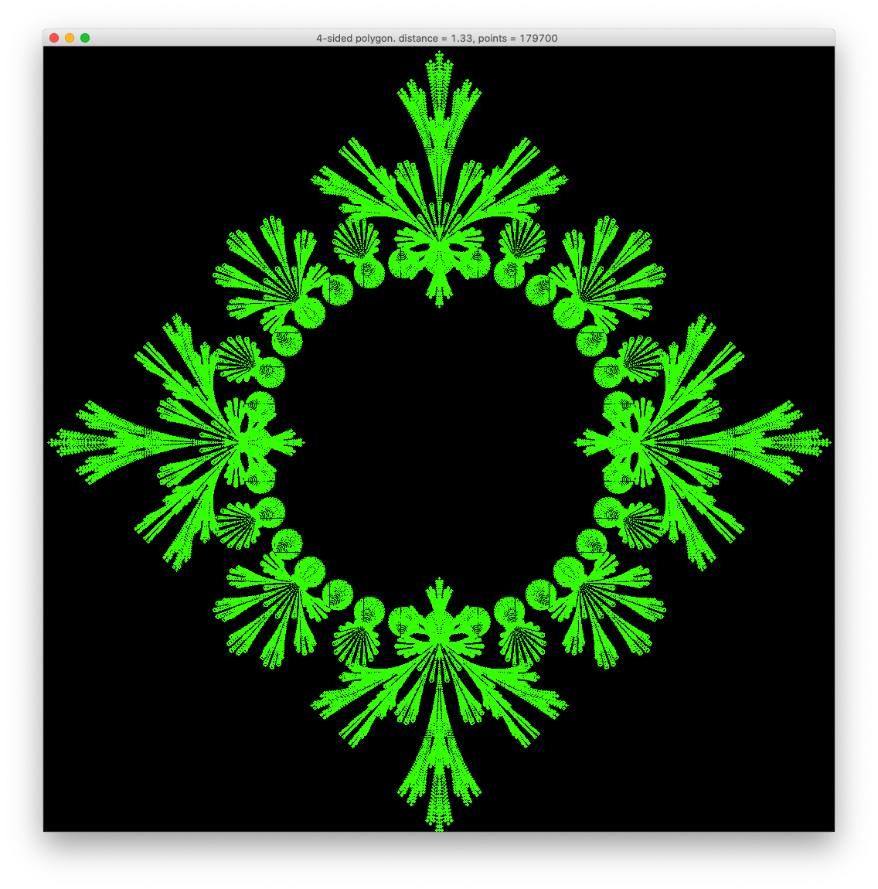
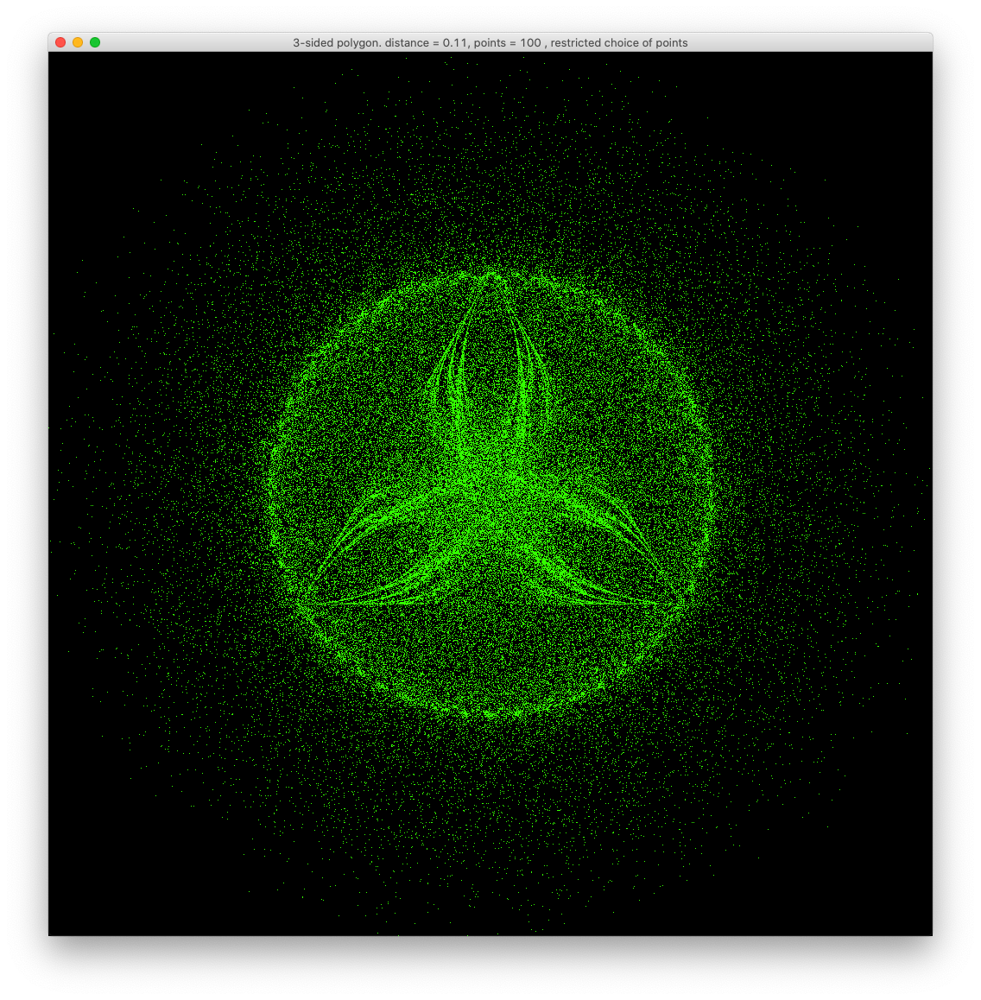
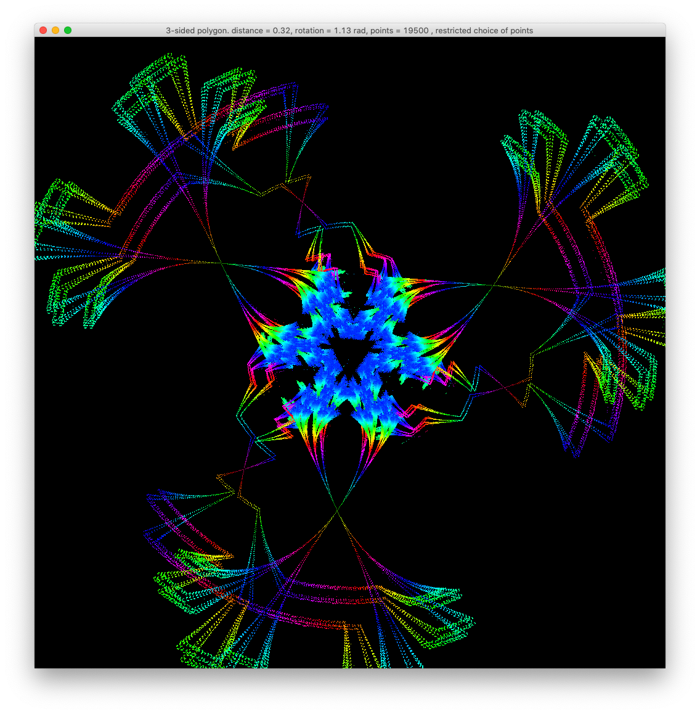
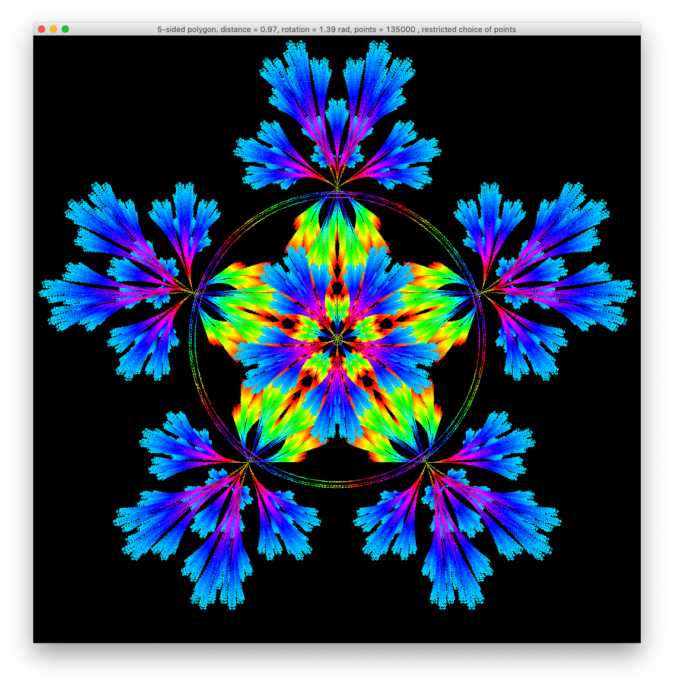
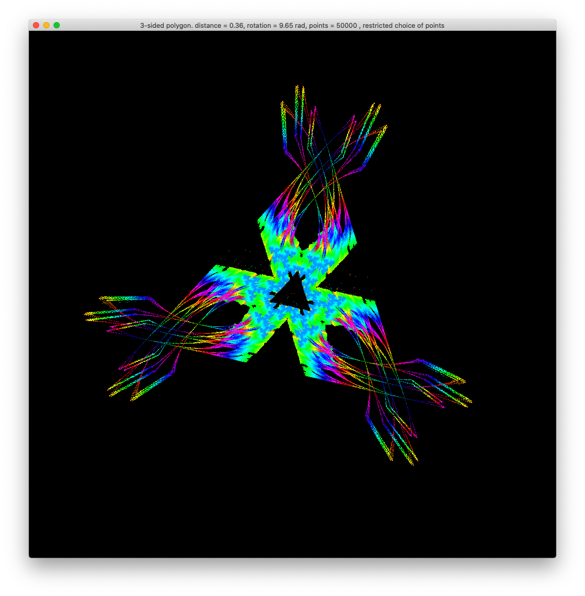
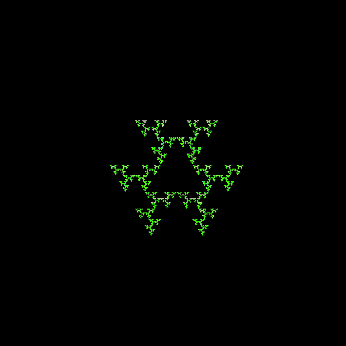

# Fractal Paint

`sbt run` should launch the window

## How this works

You mush the buttons and it produces beautiful pictures. Don't forget to press Space from time to time.

## How to draw like this
take a regular polygon and pick a random vertex, then travel half-way towards it (starting point will be the top-most point in our case). Draw a dot in your end-position. Pick another random vertex, travel half way to it. Repeat X times. This app lets you control several parameters: do you travel half-way / quarter-way / one-and-a-half-way towards the next random vertex? Can you repeatedly choose the same vertex? How many dots do you want to draw? and a few more, see table below.

## Keys

keys | function
--- | ---
Up/Down | increase/decrease distance a dot will travel from one point to the next vertex of the master polygon
Left/Right | rotate CCW/CW
I/O | zoom In / Out
A/Z | add/remove points to the master polygon
S/X | more/fewer dots will be painted each redraw
Space | toggle redrawing of the whole canvas on each refresh
C | add an additional point in the centre of the polygon
R | restrict choice of next point (dot will not attempt to go towards the same point twice in a row)
T | tether the hue change to every re-draw of the image
H | change the hue of the dots' colour
Q | quit

## Examples

This project was inspired by this tweet:
https://twitter.com/CentrlPotential/status/1250172108811927552

App was created by Peter Perhac on Friday evening (15 May 2020) and perfected little by little over the next few days. This repository was created on Monday 19 May 2020.
